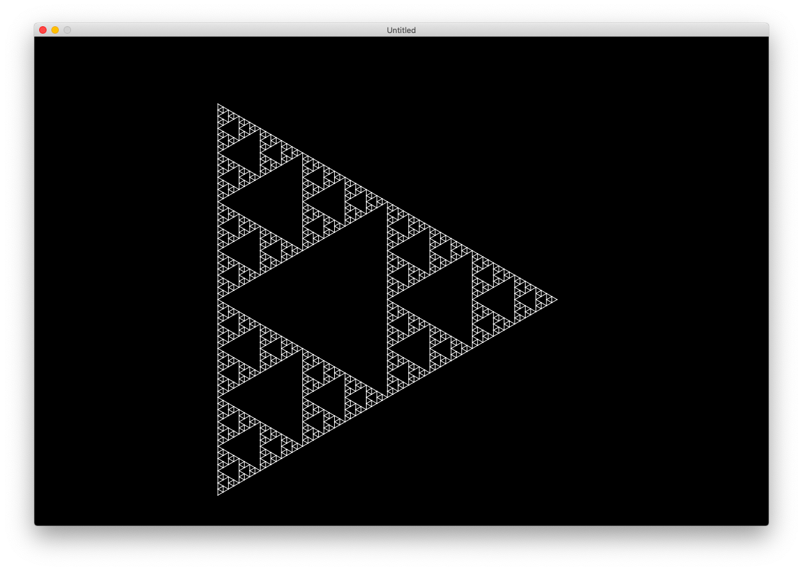
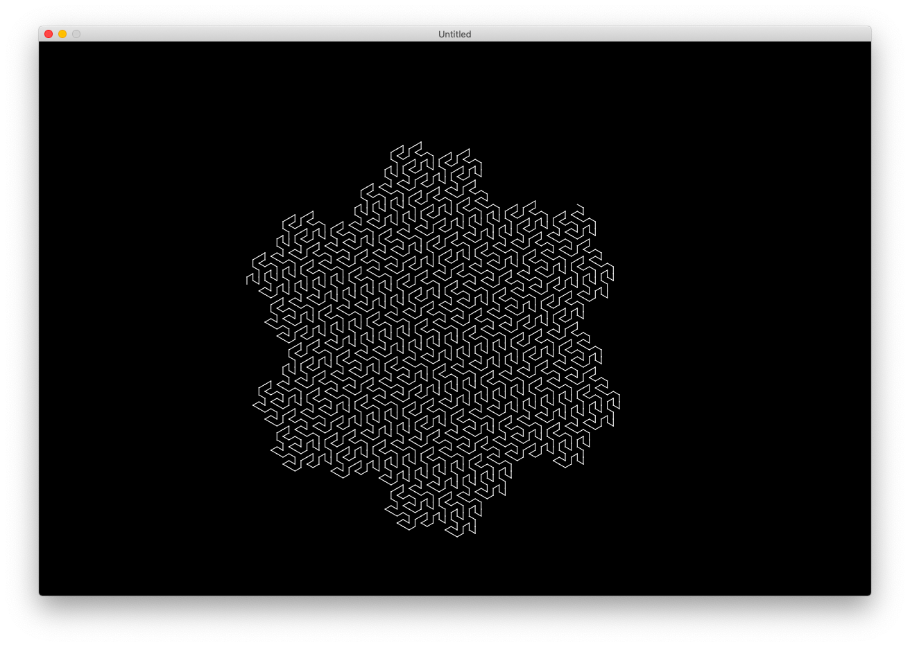
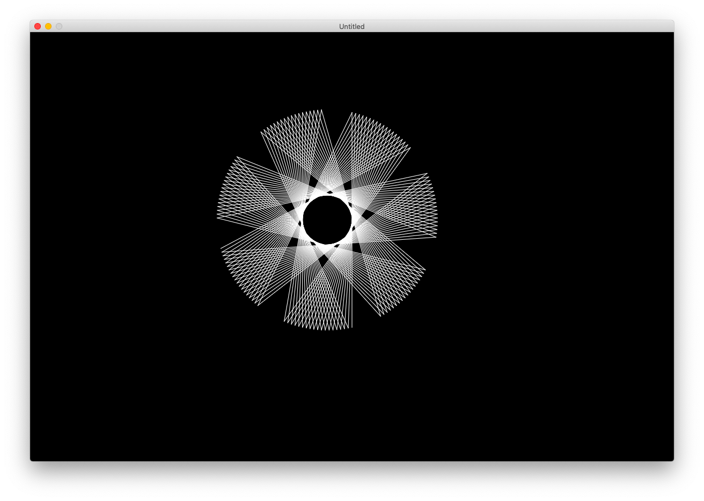
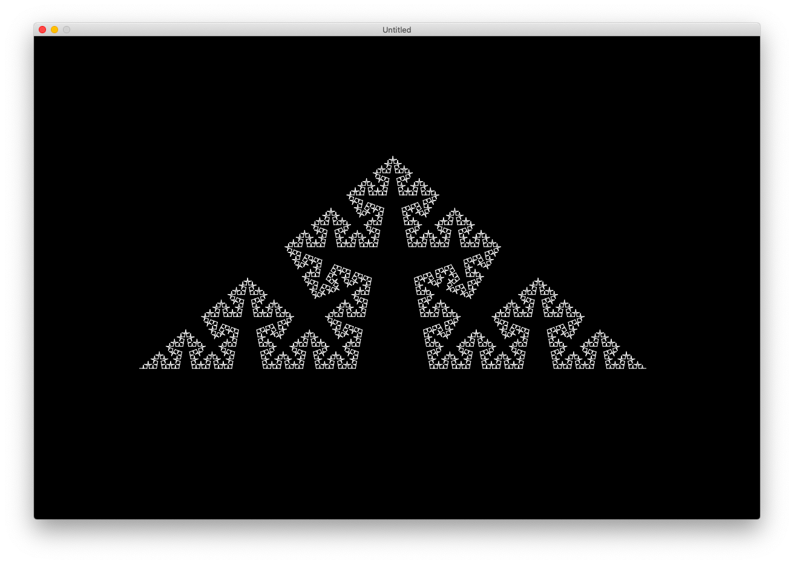
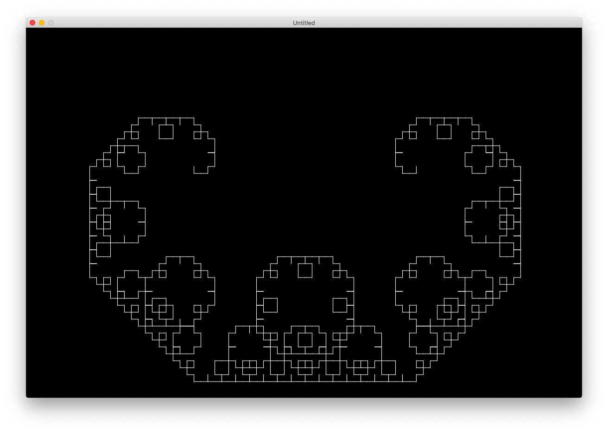

# lsystem
Implementation of L-System in Lua

Drawing in Love2D

### Results
System taken from [this site](https://onlinemathtools.com/l-system-generator) and from [Wiki page](https://en.wikipedia.org/wiki/L-system)

### Known Bugs