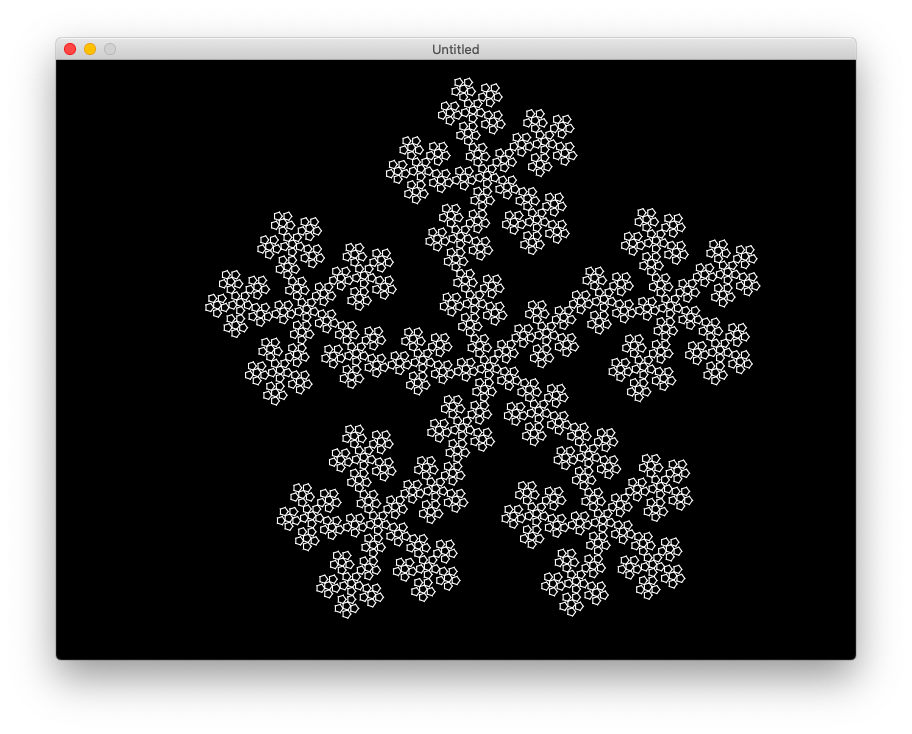

# lsystem
Implementation of L-System in Lua

Drawing in Love2D

### Results
System taken from [this site](https://onlinemathtools.com/l-system-generator)

### Known Bugs
Sometimes outputting of systems is incorrect, especially of systems from [Wiki](https://en.wikipedia.org/wiki/L-system#Types_of_L-systems)

Does not support two or more variables